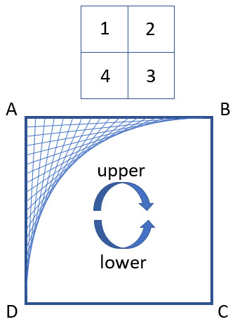

# Line Art


## Panel language



E,F,G,H are big-corners of the display (A,B,C,D).

`TODO: This has evolved. Discuss here.`

  - Configs
  - CW/CCW
  - Divisions
  - Offsets
  - Plus (simultaneous)
  - Sleep
  - Clear UNDO


## Christmas 2019

For the Circuit Playground Bluefruit + TFT Gizmo

```python
# The display script
SCRIPT = [    
    'Config FOUR',
    'Color 0='+C_Teal, 
    'Color 1='+C_Red,
    'Color 2='+C_Aqua,
    'Color 3='+C_Lime,
    'Draw 0A.1+1B+2C+3D',
    'Draw 0C.2+1D+2A+3B',
    'Draw 0D.3+1C+2B+3A',
    'Sleep 5',
    'Clear UNDO',   
```


```python    
    'Config BIG',
    'Color 0='+C_Black, 
    'Color 1='+C_Green, 
    'Color 2='+C_White,
    'Draw 0A.1+0B+0C+0D',
    'Config FOUR', 
    'Draw 0C.2+1D+2A+3B',
    'Sleep 2',
    'Clear UNDO',
```


```python
    'Config FOUR',    
    'Draw 0A.1+1B+2C+3D',
    'Draw 0C.2+1D+2A+3B',
    'Sleep 5',
    'Clear UNDO',    
]
```
